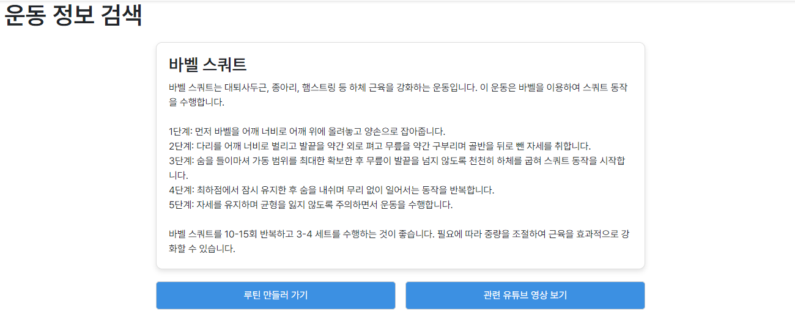
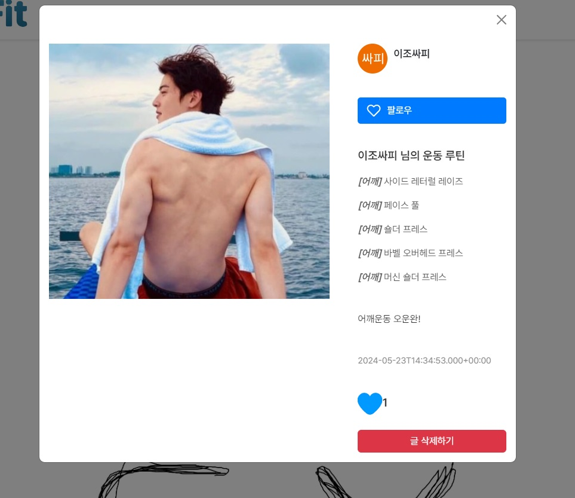

# First_Semester_FINALE

### 樂土畢 : 신나게(樂) 운동하고(FIT) 토요일에(土) 마치자(畢)! 

# 목차
- [개요](#개요)
- [프로젝트 설명](#프로젝트-설명)
  - [기술 스택](#기술-스택)
  - [기능](#기능)
    - [메인페이지](#메인페이지)
    - [상세페이지](#상세페이지)
    - [알림](#알림)

# 개요
- **프로젝트 이름**: 락토핏 ! 
- **프로젝트 기간**: 2024.05.01~2024.05.23
- **개발 언어**: JAVA, JAVASCRIPT
- **프레임워크**: SPRING, VUE.JS 
- **멤버**: 조수연(팀장, 프론트엔드), 이동엽(팀원, 백엔드)

# 프로젝트 설명

## 기술 스택

  
    
    
  
  
  
  
    
   
  
    

## 기능

### 메인페이지

https://github.com/5ooyeon/LACTOFIT/assets/164111972/76f4c54e-02d0-4bf0-bc79-1c1c259861ea

* Google api를 사용하여 소셜 로그인을 구현하였습니다.

 

https://github.com/5ooyeon/LACTOFIT/assets/164111972/c955fd42-487f-4241-a5e5-dd9752bfd6a9

* OpenAi api를 사용해 ChatGpt에 운동설명을 검색하게 하고 검색한 운동을 루틴에 추가 및 운동으로 영상 검색을 하도록 하였습니다.

 

https://github.com/5ooyeon/LACTOFIT/assets/164111972/4bc7d1cd-49f2-424c-bcee-b85fd6504d5a

* Google api 를 사용해 유튜브에 동영상을 검색하고 동영상에 댓글을 남길 수 있는 기능을 구현하였습니다.

 

https://github.com/5ooyeon/LACTOFIT/assets/164111972/805fc379-5f90-4198-b2e2-426366ecabb4

* 운동 기록/계획을 할 수 있게 루틴을 등록하는 기능을 구현하였습니다.
  
 

https://github.com/5ooyeon/LACTOFIT/assets/164111972/9350c251-bd8a-4dcd-9b88-de43c58fd2fd

* 만든 루틴으로 오.운.완 게시글 CRUD 기능과 게시글 작성시 스트릭 기능을 구현하였습니다.

 

https://github.com/5ooyeon/LACTOFIT/assets/164111972/1b298aac-790e-4cdd-ad1f-74ed1b8e3f0f

* 스트릭 변경권 뽑기와 스트릭 변경을 구현하였습니다.

 

### 상세페이지

#### 오.운.완 게시글 상세 > 팔로우, 좋아요

* 게시글 상세화면 입니다. 유저간 팔로우 기능과 게시글 좋아요 기능을 구현하였습니다.

 

### 알림

* 알림 기능입니다. 타 유저가 팔로우하거나 내 게시글에 좋아요 했을 때 알림이 오도록 하였습니다.

 

### 회고  
> 한 학기 동안 RESTful API CRUD를 스프링부트로 구현하는 프로젝트를 진행하며 많은 것을 배웠습니다. 
> 프로젝트를 마무리하면서 기획을 더 상세히 하고 명세를 꼼꼼히 정리했으면 불필요한 코드를 줄일 수 있었을 것 같아 아쉬움이 남습니다. 
> 최고의 페어를 만나 협업이 원활하게 진행되어 최우수상을 수상한 것은 큰 영광이었고, 협업을 통해 아직 배워야 할 점이 많다는 것을 깨달았습니다.
